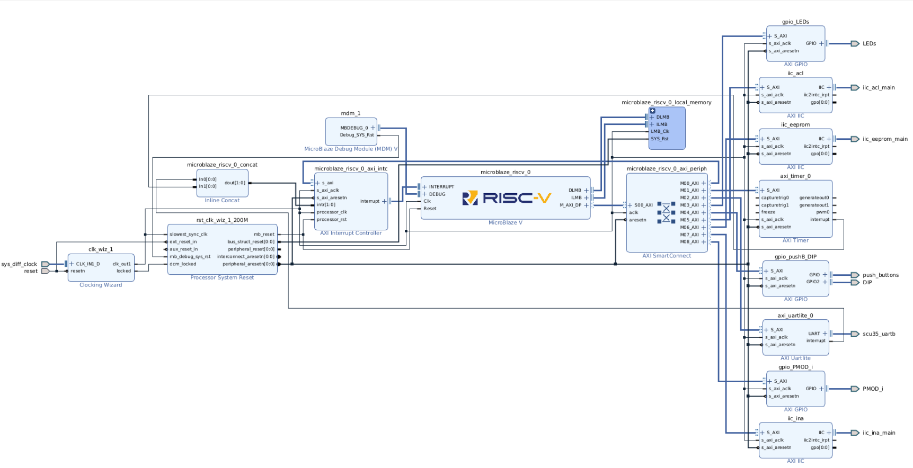
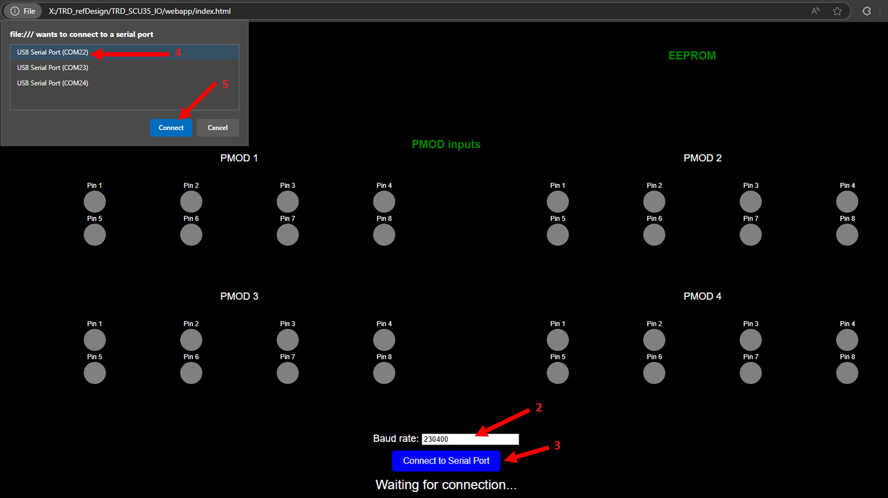
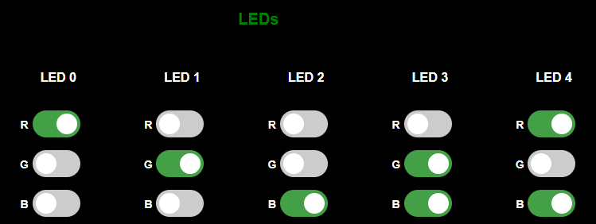
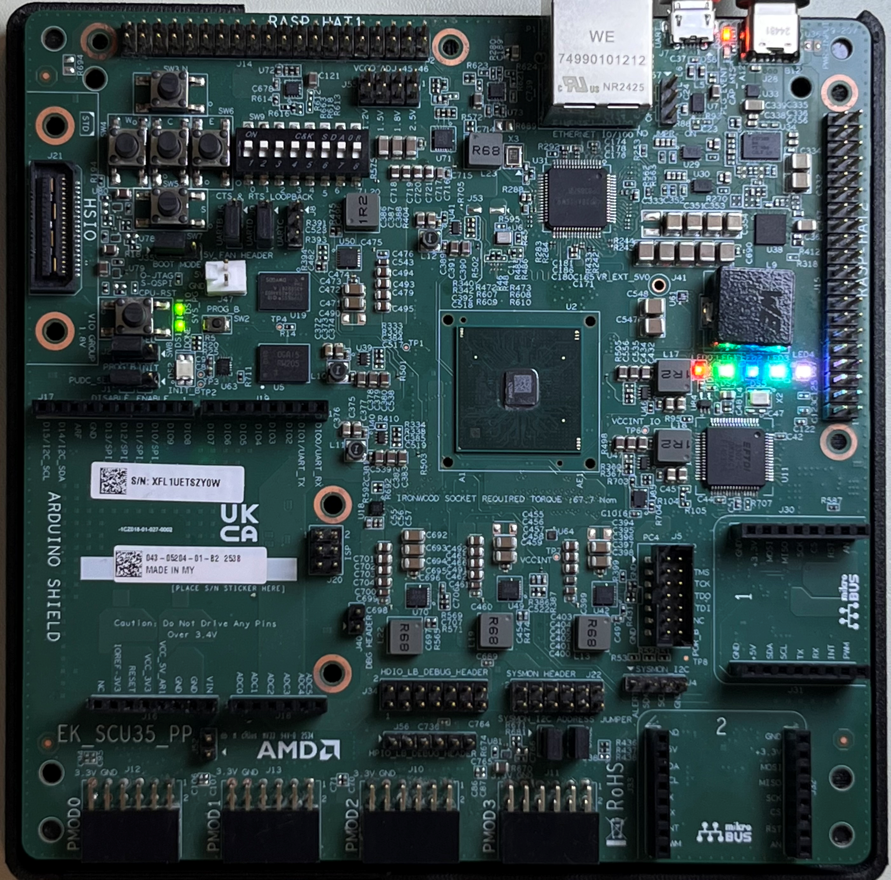
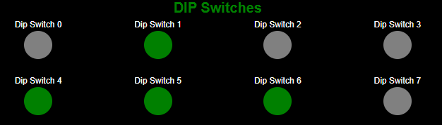
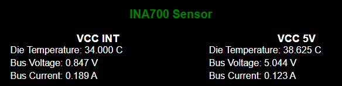
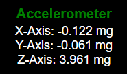
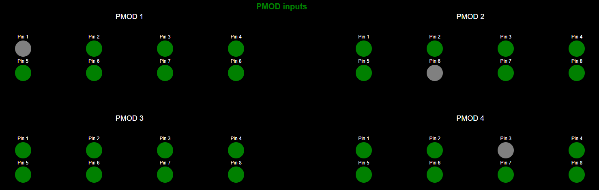

<table class="sphinxhide" style="width:100%;">
  <tr>
    <td align="center">
      <picture>
        <source media="(prefers-color-scheme: dark)" srcset="https://raw.githubusercontent.com/Xilinx/Image-Collateral/main/logo-white-text.png">
        
      </picture>
      <h1>SCU35 IO Targeted Reference Design (TRD)</h1>
    </td>
  </tr>
</table>

# Instructions

- [Introduction](#introduction)
  - [Prerequisites](#prerequisites)
    - [Clone the Source Repository](#clone-the-source-repository)
  - [Automatically Build the Entire Design](#automatically-build-the-entire-design)
- [Build the SCU35 IO TRD Hardware Platform](#build-the-scu35-io-trd-hardware-platform)
  - [Analyze the Hardware Platform](#analyze-the-hardware-platform)
- [Build the Software Application](#build-the-software-application)
  - [Analyze the Vitis Workspace](#analyze-the-vitis-workspace)
- [Generate the Device Image](#generate-the-device-image)
- [Run the TRD](#run-the-trd)

## Introduction

This document walks through building and running the SCU35 IO Targeted Reference Design (TRD). It is complimentary to the [SCU35 IO TRD User Guide](https://docs.amd.com/r/en-US/xd332-scu35-trd-ug).

## Prerequisites

- AMD Vivado&trade; Design Suite 2025.2 release
- AMD Vitis&trade; Unified Software Platform 2025.2 release
- Google Chrome version 89 or newer

### Clone the Source Repository

Clone the Git repository for the current release.

```bash
# Create and move to directory where the source repository is to be cloned
mkdir -p </path/to/source/repo>
cd </path/to/source/repo>

# clone git repo and switch to the current release tag (v2025.2)
git clone https://github.com/Xilinx/scu35-io-trd.git
cd scu35-io-trd
git checkout v2025.2
```

The repository contains the following:

```
├── hw/
|   ├── scripts/
|   |   ├── add_elf.tcl
|   |   ├── config_bd.tcl
|   |   └── main.tcl
|   ├── xdc/
|   |   └── io_design.xdc
|   └── Makefile
├── prebuilt/
|   ├── io_app.elf
|   ├── scu35_io_design.xsa
|   └── scu35_io_design_wrapper.pdi
├── sw/
|   ├── src/
|   |   ├── inputs/
|   |   |   ├── accelerometer.c
|   |   |   ├── accelerometer.h
|   |   |   ├── CMakeLists.txt
|   |   |   ├── dipSwitches.c
|   |   |   ├── dipSwitches.h
|   |   |   ├── ina700.c
|   |   |   ├── ina700.h
|   |   |   ├── pmodGPIO.c
|   |   |   ├── pmodGPIO.h
|   |   |   ├── pushButton.c
|   |   |   └── pushButton.h
|   |   ├── outputs/
|   |   |   ├── CMakeLists.txt
|   |   |   ├── LEDs.c
|   |   |   └── LEDs.h
|   |   ├── CMakeLists.txt
|   |   ├── crc16CCIT_calculator.c
|   |   ├── crc16CCIT_calculator.h
|   |   ├── input_manager.c
|   |   ├── input_manager.h
|   |   ├── main.c
|   |   ├── output_manager.c
|   |   ├── output_manager.h
|   |   ├── uart_config.c
|   |   └── uart_config.h
|   ├── create_sw_design.py
|   └── Makefile
├── webapp/
|   ├── src/
|   |   ├── inputs/
|   |   |   ├── accelerometer.js
|   |   |   ├── dipSwitches.js
|   |   |   ├── ina700.js
|   |   |   ├── pmodGPIO.js
|   |   |   └── pushButton.js
|   |   ├── outputs/
|   |   |   └── LEDs.js
|   |   ├── crc16CCIT_calculator.js
|   |   ├── input_manager.js
|   |   ├── main.js
|   |   ├── output_manager.js
|   |   └── uart_config.js
|   ├── styles/
|   |   ├── AMD_logo.png
|   |   ├── DIPswitches.css
|   |   ├── INA700.css
|   |   ├── LEDs.css
|   |   ├── main.css
|   |   ├── microblaze-v-hero-graphic-banner.png
|   |   ├── pmodGPIO.css
|   |   └── pushButton.css
|   └── index.html
└── Makefile
```

- The *hw* folder contains the required script and files to build the hardware platform and generate the bitstream.
- The *prebuilt* folder contains the pre-generated file for the hardware platform, the software application, and the bitstream.
- The *sw* folder contains the source and header file and the script to generate the software application.
- The *webapp* folder contains the required scripts, source file, and style file to run the web application in a web browser.

## Automatically Build the Entire Design

1. On Linux, set up the Vivado environment in a terminal window by sourcing `<Vivado_install_path>/settings64.sh`.
2. To build the entire design, type the following in the directory where you cloned the TRD:

   ```bash
   make all
   ```

   The following message displays and indicates where to find the device image:

   ```bash
      The device image with the embedded software application
      was successfully generated. It is located here:
      hw/project/scu35_io_design_wrapper.pdi
   ```

3. Navigate to the [Run the TRD](#run-the-trd) section to load and run the design on the SCU35 evaluation board.

## Build the SCU35 IO TRD Hardware Platform

1. On Linux, set up the Vivado environment in a terminal window by sourcing `<Vivado_install_path>/settings64.sh`.
2. To build the hardware platform, type the following in the directory where you cloned the TRD:

   ```bash
   make xsa
   ```

The hardware platform is available here: `hw/project/scu35_io_design.xsa`.

### Analyze the Hardware Platform

1. Open the Vivado IDE.
2. Open the hardware project from `hw/project/scu35_io_design.xpr`.
3. Open the block design.
4. Analyze the Block Design.
   
   1. Look at the MicroBlaze&trade; V configuration.
   2. Look at how the peripherals connect to the MicroBlaze V processor.
   3. In the Address Editor, inspect how the registers are mapped for each peripheral.
5. Open the Synthesized Design, and explore the reports.

## Build the Software Application

The Vitis environment consumes the generated hardware platform to build the software application that runs on the MicroBlaze V processor. Before building the application, you must complete the previous step.

1. On Linux, set up the Vitis environment in a terminal window by sourcing `<Vitis_install_path>/settings64.sh`.
2. To build the software application, type the following in the directory where you cloned the TRD:

```bash
make elf
```

The software application is available here: `sw/workspace/io_app/build/io_app.elf`.

### Analyze the Vitis Workspace

1. Open the Vitis IDE.
2. Set the Workspace to `sw/workspace/`.
3. Explore how Vitis (io_plt) consumes the platform.
4. Look at the application (io_app) sources and outputs.

## Generate the Device Image

This step combines the generated software application and the hardware platform to generate a bitstream to directly load onto the AMD Spartan&trade; UltraScale+&trade; FPGA SCU35 evaluation board. This includes associating the elf file to the MicroBlaze V processor, going through the implementation process, and generating the bitstream.

This step assumes that you already generated the hardware platform and software application.

On Linux, to set up the Vivado environment in a terminal window, source `<Vivado_install_path>/settings64.sh`.
To generate the device image, type the following in the directory where the TRD was cloned:

```bash
make pdi
```

The following message displays indicating where to find the device image:

```bash
    The device image with the embedded software application
    was successfully generated. It is located here:
    hw/project/scu35_io_design_wrapper.pdi
```

## Run the TRD

This section walks through running the TRD on the SCU35 evaluation board.

1. Program the SCU35 evaluation board.
   1. Open the Vivado GUI.
   2. Open Hardware Manager.
   3. Connect to the board.
   4. Program the device with the `hw/project/scu35_io_design_wrapper.pdi` file.
2. Configure the web application
   1. Open the `webapp/index.html` file with the Chrome web browser.
   2. Scroll to the bottom of the page, and set the Baud rate to `230400`.
   3. Click **Connect to Serial Port**.
   4. Select the first serial port.
   5. Click **Connect**.

      

      > **Important**: If an issue occurs with the serial port connection, you can reset the connection between the web application and the MicroBlaze V by pressing the CPU-RST reset button on the SCU35 evaluation board; this refreshes the webpage and repeats the process to connect to the serial port.

3. Test the push buttons.

   Use the push buttons to move the red square in the grid, the middle button set, or unset the AMD logo.

   

4. Test the LEDs.

   The web application controls the LEDs; you can set any RGB combination.

   

   

5. Test the DIP switches.
  
   In the web GUI, the DIP switches turn on or off the green LEDs.

   

6. Test the INA700 sensors.

   The INA700 sensors report the die temperature, the bus voltage, and bus current of the VCC INT and VCC 5V.

   

7. Test the accelerometer.

   The accelerometer reports on the orientation of the evaluation board. You can carefully change the orientation of the board and see the position changes in the GUI.

   

<!--
1. Test the EEPROM.

   The EEPROM ...

   
-->

8. Test the PMODs.

   The PMODs are all configured as inputs. A pull-up resistor connects to each input, and by default, the PMOD LEDs display as green in the web GUI. If you connect a jumper wire between a PMOD input and a PMOD ground, it turns off the associated PMOD LED.

   

<hr class="sphinxhide"></hr>

<p class="sphinxhide" align="center"><sub>Copyright © 2025 Advanced Micro Devices, Inc.</sub></p>

<p class="sphinxhide" align="center"><sup><a href="https://www.amd.com/en/corporate/copyright">Terms and Conditions</a></sup></p>
