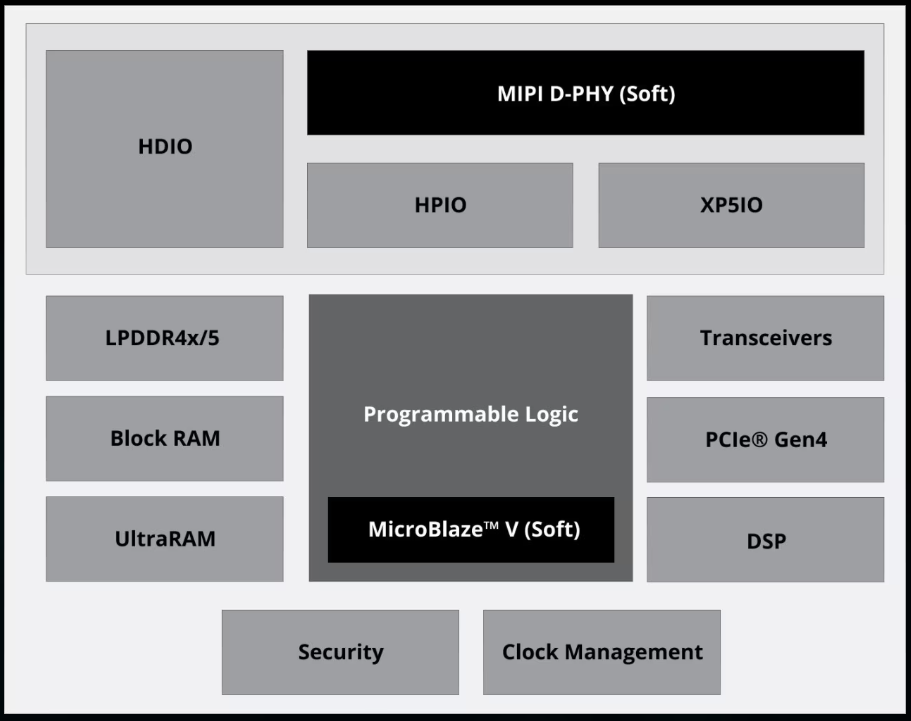
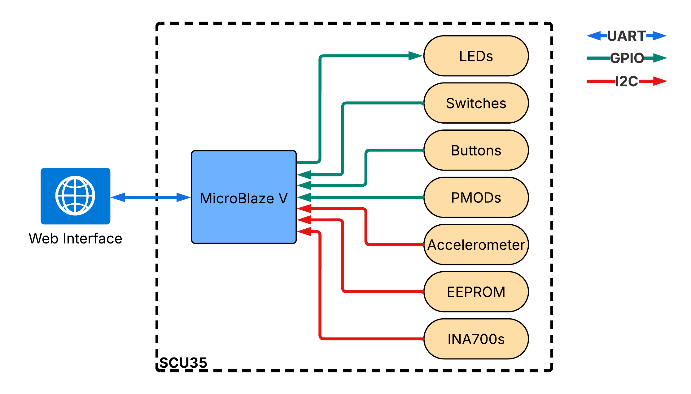
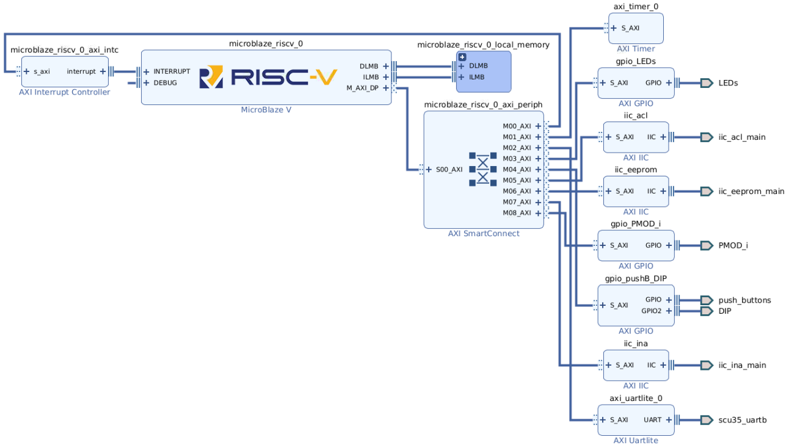

<table class="sphinxhide" style="width:100%;">
  <tr>
    <td align="center">
      <picture>
        <source media="(prefers-color-scheme: dark)" srcset="https://raw.githubusercontent.com/Xilinx/Image-Collateral/main/logo-white-text.png">
        
      </picture>
      <h1>SCU35 IO Targeted Reference Design (TRD)</h1>
    </td>
  </tr>
</table>

# User Guide

- [Introduction](#introduction)
  - [Spartan UltraScale+ FPGA Overview](#spartan-ultrascale-fpga-overview)
  - [Reference Design Overview](#reference-design-overview)
    - [Required Tools](#required-tools)
- [Hardware Platform](#hardware-platform)
  - [Clocks, Resets, and Interrupts](#clocks-resets-and-interrupts)
- [MicroBlaze V Software Platform](#microblaze-v-software-platform)
  - [Host Communication](#host-communication)
    - [Message Structure](#message-structure)
    - [Initialization](#initialization)
  - [Peripherals Management](#peripherals-management)
  - [Interrupts and Tasks Scheduler](#interrupts-and-tasks-scheduler)
- [Web Application](#web-application)
- [References](#references)

## Introduction

The SCU35 IO Targeted Reference Design (TRD) demonstrates how to create a simple Human Machine Interface (HMI) using the AMD Spartan&trade; UltraScale+&trade; SCU35 evaluation board and the AMD MicroBlaze&trade; V processor.

The TRD consists of an AMD Vivado&trade; design, an AMD Vitis&trade; standalone application, and a web application interface.

This guide describes the architecture of the reference design, provides the description of its components, and provides instructions on building and running the design. It is organized as follows:

- This chapter provides a high-level overview of the Spartan UltraScale+ device architecture, the reference design architecture, and highlights the key features.
- [Hardware Platform](#hardware-platform) describes the hardware platform of the design including the key peripherals.
- [MicroBlaze V Software Platform](#microblaze-v-software-platform) describes the standalone (bare-metal) software application that runs on the MicroBlaze V soft processor.
- [Web Application](#web-application) describes the web application that supports this reference design.
- [Tutorials](https://docs.amd.com/r/en-US/xd333-scu35-trd-instructions) describes the steps to build and run the reference design.

### Spartan UltraScale+ FPGA Overview

The Spartan UltraScale+ device is an FPGA built on the 16 nm FinFET UltraScale architecture. The following figure shows a high-level block diagram of the device architecture.

> *Figure 1*: Spartan UltraScale+ Block Diagram

The following summarizes the key features of the Spartan UltraScale+ device:

- Memory Controller
- Integrated PCIe&reg; support
- MIPI support
- GTH Transceivers
- Platform Management Controller (PMC)
- High-Performance I/O (HPIO) with voltage support from 1.0V to 1.8V
- High-Density I/O (HDIO) with voltage support from 1.2V to 3.3V

### Reference Design Overview

The Spartan UltraScale+ is an FPGA device; this reference design targets the SCU35 evaluation board. It implements an AMD MicroBlaze&trade; V soft processor in the programmable logic (PL). The device leverages a MicroBlaze V processor to monitor and interact with the inter IC (I2C) and general purpose I/O (GPIO) peripheral built into the SCU35 evaluation board. The implementation of a soft processor in the PL enables the deployment of a standalone software application to update and poll the state of the peripherals. Through a universal asynchronous receiver-transmitter (UART) connection, the processor communicates with a web-based application running on a host machine. The following figure shows a high-level view of the targeted reference design.

> *Figure 2*: SCU35 IO TRD high level view

#### Required Tools

- Vivado Design Suite 2026.1 release
- Vitis Unified Software Platform 2026.1 release
- Google Chrome version 89 or newer

## Hardware Platform

This chapter describes the reference design hardware architecture. The following figure shows the block diagram of the design component inside the PL.

> *Figure 3*: SCU35 IO TRD Hardware Platform

At a high-level, the design divides into three subsystems:

- Processor subsystem
  - MicroBlaze V
  - AXI interrupt controller
  - Local memory
  - AXI SmartConnect
  - AXI Timer
- Peripherals subsystem
  - LEDs
  - PMODs
  - Push Buttons
  - DIP Switches
  - Accelerometer (iic_acl_main)
  - Electrically erasable programmable read-only memory (EPROM) (iic_eeprom_main)
  - INA700 (iic_ina_main)
- UART interface

The processor subsystem consists of the MicroBlaze V soft processor and additional components ensuring its proper functioning and optimal performance. The MicroBlaze V processor is a highly configurable soft-core microprocessor offering flexibility for integration into FPGA-based designs. An AXI Interrupt Controller supports the processor, managing and prioritizing signals from various sources to allow the processor to efficiently handle both hardware and software events. A dedicated on-chip Local Memory complements the processor storing code and data which results in faster access times and lower latency compared to external memory sources. The AXI SmartConnect IP efficiently manages data transfers between the processor, memory, and peripheral components leveraging configurable AXI protocols for high-performance interconnectivity. Additionally, the AXI Timer module provides precise timing and interval measurements, supporting real-time operations and task scheduling.

The peripherals subsystem leverages AXI I2C and AXI GPIO interfaces connecting directly to the FPGA I/Os. These interfaces provide a unified means for communicating with the evaluation board's various external components. The design routes signals from the FPGA pins directly to elements, such as LEDs, PMODs, push buttons, DIP switches, accelerometers, EEPROM, and INA700 devices, enabling streamlined and standardized access through the AXI protocols. This approach minimizes design complexity while enhancing scalability and ease of integration, ensuring that each device communicates efficiently with the core system.

The UART subsystem provides a dedicated communication channel between the processor and the host PC. This module sends and receives serial data during operation. By interfacing with the processor through the AXI SmartConnect, the UART subsystem ensures seamless integration and efficient data transfers throughout the system. This provides a reliable communication link for real-time interactions and command executions between the host and the processor.

### Clocks, Resets, and Interrupts

The following table identifies the clocks in the hardware design, their source, frequency, and function.

> *Table 1:* System Clocks

| Clock | Clock Source | Clock Frequency | Function |
| --- | --- | --- | --- |
| sys_diff_clock | TLSM2 (external) | 100 MHz | FPGA clock source for clocking wizard|
| microblaze_riscv_0_Clk | Clocking Wizard | 200 MHz | Clock source for all IPs in the design |

The TLSM2 oscillator on the SCU35 evaluation board provides the *sys_diff_clock* clock, which serves as the reference input clock for the Clocking Wizard instance inside the FPGA.

The Clocking Wizard instance generates the *microblaze_riscv_0_Clk* clock, deriving it from the *sys_diff_clock*, driving all the AXI interfaces and the MicroBlaze V subsystem.

> *Table 2:* System and User Resets

| Reset | Reset Source | Purpose |
| --- | --- | --- |
| reset | CPU-RST (external) | User reset to reset the system, including the peripheral, to their initial state |
| debug_sys_rst | MicroBlaze Debug Module (MDM) V | Debug reset to reset the system, including the peripheral, to their initial state |
| mb_reset | Processor System Reset | System reset to reset the MicroBlaze V core |
| bus_struct_reset | Processor System Reset | System reset to reset the local memory |
| peripheral_aresetn | Processor System Reset | Asynchronous system reset to reset the peripheral |

Use the *reset* and *debug_sys_rst* resets to reset the entire system. The *reset* connects to the CPU-RST button on the SCU35 evaluation board.

The Processor System Reset generates the three reset signals: *mb_reset*, *bus_struct_reset*, and *peripheral_aresetn*. The *bus_struct_reset* comes out of reset first, followed by the *peripheral_aresetn* reset, and then the *mb_reset*.

## MicroBlaze V Software Platform

This chapter describes the standalone (bare-metal) software platform which executes on the MicroBlaze V processor. The platform divides into three domains:

- Host communication (UART)
- Peripherals management
- Interrupts and tasks scheduler

### Host Communication

The design leverages the UART to communicate with the host PC. As part of the host communication domain, it implements a checksum algorithm and handshake sequence to synchronize the host PC and the MicroBlaze V processor.

#### Message Structure

Because no built-in mechanism verifies the validity of the data exchanged through the UART, a custom implementation was developed for this design. The message sent through the UART must always have 23 long formatted characters, as follows:

| Characters Position | Name    | Description                                                                                                |
|---------------------|---------|------------------------------------------------------------------------------------------------------------|
| 0 - 3               | Header  | Indicates if the message originates from the MicroBlaze V (`m2c{`) or the web console (`c2m{`).            |
| 4 - 19              | Payload | Contains the information shared between the MicroBlaze V and the web console.                              |
| 20 - 22             | Tail    | Closes the payload (`}`) and the last two characters correspond to the checksum to validate the payload.   |

The header can only have two valid values. If the message originates from the MicroBlaze V processor and is designated for the web console, it uses the value "m2c". If it originates from the other direction, it uses the value "c2m". The fourth character is an opening curly brace (`{`), indicating that the next characters are the payload. If any characters are lost, then the header also resyncs with the web console and the MicroBlaze V processor.

The payload always consists of 16 characters long and contains the information shared between the MicroBlaze V and the web console. It contains an update to apply to one of the output devices or an update of the value from one of the input devices.

The tail starts with a closing curly brace (`}`), indicating the end of the payload. The last two characters represent the checksum results calculated using the CRC16 CCIT algorithm.

#### Initialization

Before starting to exchange device status and update between the web console and the UART, a handshaking sequence must occur. The following handshake sequence occurs:

1. The web console repeatedly sends a synchronization signal.
2. When received, the MicroBlaze V processor repeatedly sends a synchronization signal.
3. After the web console receives the synchronization signal from the MicroBlaze V processor, it sends an acknowledgement signal.
4. The MicroBlaze V processor then sends a last acknowledgement signal.

After the handshaking sequence completes, the MicroBlaze V sends the status of each device to the web console.

### Peripherals Management

The peripherals management domain directly interacts with the AXI peripherals IP to monitor and update the SCU35 evaluation board devices, which includes the LEDs, PMODs, push buttons, DIP switches, accelerometers, EEPROM, and INA700 devices.

Each device has its own piece of software code consisting of functions to initialize the peripheral and to read and write data to peripheral to get the status of the device or to update it. The code leverages the I2C and GPIO drivers to communicate with the AXI IP.

You can find the specific header and source file in the Vitis workspace *inputs* and *outputs* folders. The following list corresponds to the header and source files for each device. This approach ensures greater scalability, when adding a new device to the system does not interfere with the existing one as they each have their separate source file.

- inputs/accelerometer
- inputs/dipSwitches
- inputs/ina700
- inputs/pmodGPIO
- inputs/pushButton
- outputs/LEDs

### Interrupts and Tasks Scheduler

For this design, the UART is the only peripheral that uses interrupts. When the UART bus receives new data, an interrupt triggers. This interrupt-driven approach frees the processor from constantly monitoring the UART, allowing it to focus on external peripherals when no UART data is present.

The MicroBlaze-V processor has two primary tasks. First, it continuously monitors the state of input peripheral devices and forwards any changes to the web console via the UART. Second, it updates the state of the output devices when a message is received from the web console.

For the outputs, an update occurs only when a new message is received over the UART via an interrupt, so the scheduler does not manage this task. In contrast, the inputs do no use interrupts. Instead, the processor constantly polls the state of each device to detect changes. The task scheduler integrates the reading of input device statuses, allowing for a modular approach that simplifies adding new peripherals to the design. Some peripherals can be polled at any frequency, while others require a delay between queries. A timer is used to ensure that each peripheral is queried at the appropriate interval.

## Web Application

To visualize and interact with the SCU35 evaluation board peripherals, this TRD includes a web application. You do not need to build the web application, because it runs natively in a Chromium-based web browser, leveraging the Web Serial API. The web application follows the same modular approach; each peripheral has its own section, style file, and script file.

Because the web application communicates through the serial port with the MicroBlaze V, it uses the same approach. Initialization must be done prior to exchanging peripheral states, the same message format must be used, and the computation of the checksum must be done to ensure the integrity of the messages. For more details, refer to the [Host Communication](#host-communication) section.

## References

1. [AMD Spartan UltraScale+ FPGA](https://www.amd.com/en/products/adaptive-socs-and-fpgas/fpga/spartan-ultrascale-plus.html)

2. UltraScale+ FPGAs Product Selection Guide ([XMP103](https://docs.amd.com/go/en-US/ultrascale-plus-fpga-product-selection-guide))

3. [AMD MicroBlaze V Processor](https://www.amd.com/en/products/software/adaptive-socs-and-fpgas/microblaze-v.html)

4. MicroBlaze V Processor Reference Guide ([UG1629](https://docs.amd.com/access/sources/dita/map?isLatest=true&url=ug1629-microblaze-v-user-guide&ft:locale=en-US))

5. [Vivado Design Suite](https://www.amd.com/en/products/software/adaptive-socs-and-fpgas/vivado.html)

6. [Design Hubs](https://docs.amd.com/p/design-hubs)

7. [Vitis Unified Software Platform](https://www.amd.com/en/products/software/adaptive-socs-and-fpgas/vitis.html)

Copyright © 2025 Advanced Micro Devices, Inc.

<a href="https://www.amd.com/en/corporate/copyright">Terms and Conditions</a>

